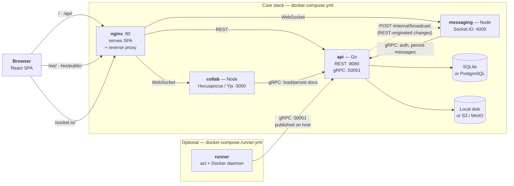

<div align="center">


# Notomate

*Note + automate.*

Self-hosted, all-in-one note-taking app with a built-in GitHub-Actions-style workflow automation engine.

**English** · [繁體中文](./README.zh-TW.md)

</div>

Write anything, anywhere — from a quick memo to a full blog post. The block-based editor supports rich text, media, and embeds. A built-in [workflow engine](#workflows-beta) automates your notes too: schedule AI digests, aggregate external data, or trigger notifications. Self-hosted, so your data stays yours.

## Installation

### Docker Compose (recommended)

```yaml
services:
  api:
    image: notomate/notomate-api
    container_name: notomate-api
    volumes:
      - notomate_data:/usr/local/app/bin
    environment:
      MESSAGING_ADDR: http://notomate-messaging:4000
      # APP_SECRET: your-secret-key
      # APP_DISABLE_SIGNUP: true
    restart: unless-stopped

  collab:
    image: notomate/notomate-collab
    container_name: notomate-collab
    environment:
      GRPC_ADDR: notomate-api:50051
      # APP_SECRET: your-secret-key
    depends_on:
      - api
    restart: unless-stopped

  messaging:
    image: notomate/notomate-messaging
    container_name: notomate-messaging
    environment:
      GRPC_ADDR: notomate-api:50051
      # APP_SECRET: your-secret-key
    depends_on:
      - api
    restart: unless-stopped

  nginx:
    image: notomate/notomate-nginx
    container_name: notomate-nginx
    ports:
      - "80:80"
    depends_on:
      - api
      - collab
      - messaging
    restart: unless-stopped

volumes:
  notomate_data:
    driver: local
```

```bash
docker compose up -d
```

The app will be available at `http://localhost`. See [`.env.example`](./.env.example) for configuration options.

All four services are required — `collab` backs the realtime editor and `messaging` backs channel chat, and nginx proxies to both. Two things to keep in mind:

- **`APP_SECRET` must be identical on `api`, `collab` and `messaging`.** It signs the session JWT that all three verify, and authenticates the api → messaging broadcast call.
- **Don't rename the containers.** nginx resolves `notomate-api`, `notomate-collab` and `notomate-messaging` by name, and `MESSAGING_ADDR` / `GRPC_ADDR` point at those same names.

## Architecture



| Service | Role |
| --- | --- |
| **nginx** | Single entrypoint on `:80`. Serves the built SPA and reverse-proxies `/api/` to api, `/ws/` + `/ws/public/` to collab, `/socket.io/` to messaging. |
| **api** | Go backend and the only writer to the database and object storage. Serves the REST API, plus a gRPC service that collab, messaging and the runner call. |
| **collab** | Hocuspocus/Yjs server for realtime, multi-cursor note editing. Stateless — it loads and persists documents through the api's gRPC service. |
| **messaging** | Socket.IO server for channel chat and presence. Sockets are scoped to one channel; messages are persisted via gRPC to api. Room state is in-memory, so run exactly one replica. |
| **runner** | Optional workflow executor, in its own compose project. Long-polls api over gRPC for queued jobs and runs each one in a container via [act](https://github.com/nektos/act). See [Workflows](#workflows-beta). |

## Workflows (beta)

Notomate ships a built-in, GitHub-Actions-style workflow engine. Workflows are defined per workspace (Workflows page in the sidebar) with GitHub-Actions-compatible YAML and executed by a separate runner service that runs each job in a Docker container via [act](https://github.com/nektos/act) — since a job can run any CLI or call any HTTP API, you can freely compose automations for scenarios like:

- **AI-powered digests** — call an LLM API on a schedule to summarize an RSS feed, GitHub issues, or a pile of notes into one readable note
- **Data aggregation** — poll public or internal APIs periodically and roll the results into a running log or daily digest note
- **Notifications** — watch note changes or external events and forward them to Slack, Discord, email, etc.
- **Cross-app sync** — mirror notes to/from calendars, issue trackers, or other tools your team uses

See [Workflow examples](#workflow-examples) below for ready-to-use starting points.

Supported triggers:

- `note` — fires on `created` / `updated` / `deleted` note events in the workspace (updates are debounced)
- `schedule` — standard 5-field cron expressions
- `workflow_dispatch` — manual runs with optional inputs

```yaml
name: Notify on note changes
on:
  note:
    types: [created, updated]
  schedule:
    - cron: "0 9 * * 1"
  workflow_dispatch:
    inputs:
      message:
        default: "hello"
jobs:
  notify:
    runs-on: ubuntu-latest
    steps:
      - run: |
          echo "event=$NM_EVENT_NAME workspace=$NM_WORKSPACE_ID note=$NM_NOTE_ID"
          cat "$GITHUB_EVENT_PATH"   # full event payload JSON
```

Jobs see the event payload at `$GITHUB_EVENT_PATH` plus `NM_EVENT_NAME`, `NM_WORKSPACE_ID`, `NM_NOTE_ID`, `NM_RUN_ID` and `NM_RUN_NUMBER`.

### Running a runner

The runner is opt-in and lives in its own compose project (`docker-compose.runner.yml`) so it can be started independently of the core stack, even on a different host:

```bash
docker compose -f docker-compose.runner.yml up -d
```

`docker-compose.yml` publishes the api's gRPC port to `127.0.0.1:50051` so a runner on the same host can reach it at `host.docker.internal:50051` (the default). If the runner runs on a different host, publish the port more broadly (mind the security note below) and point `NM_INSTANCE_ADDR` at that host:

```yaml
  notomate-runner:
    image: notomate/notomate-runner
    container_name: notomate-runner
    environment:
      NM_INSTANCE_ADDR: host.docker.internal:50051 # or remote-host:50051
      NM_RUNNER_REGISTRATION_TOKEN: your-registration-token
      NM_RUNNER_LABELS: ubuntu-latest:docker://node:20-bullseye
    volumes:
      - /var/run/docker.sock:/var/run/docker.sock
      - notomate_runner_data:/data
    restart: unless-stopped
```

Instance admins can see registered runners and the registration token in workspace settings.

### Workflow examples

See [`runner/workflow_examples`](./runner/workflow_examples) for ready-to-use examples:

- [`scheduled-note.yml`](./runner/workflow_examples/scheduled-note.yml) — minimal template that creates a note on a schedule
- [`manual-note-from-input.yml`](./runner/workflow_examples/manual-note-from-input.yml) — `workflow_dispatch` inputs to a note
- [`rss-to-notes.yml`](./runner/workflow_examples/rss-to-notes.yml) — subscribes to an RSS feed and creates a note per new item
- [`hacker-news-digest.yml`](./runner/workflow_examples/hacker-news-digest.yml) — rolls up top Hacker News stories into a daily digest note
- [`github-releases-watch.yml`](./runner/workflow_examples/github-releases-watch.yml) — notifies when a repo publishes a new release

**Security notes**

- Workflows execute arbitrary commands on the runner host's Docker daemon. Only workspace owners/admins can create or edit workflows, and the runner host is part of your trust boundary.
- Don't paste secrets into workflow YAML — definitions are readable by all workspace members. If a job needs to call the Notomate API, use an API key and be aware that a workflow that modifies notes can retrigger itself (a per-workflow rate limit of 30 runs/minute is the backstop).
- The runner protocol has token auth but no TLS. Keep the gRPC port (50051) off the public internet — the default `127.0.0.1:50051` binding in `docker-compose.yml` only allows same-host access; widen it only over a trusted network (VPN, private network) if the runner is remote.

## Contributing

Contributions are welcome! Fork the repo, create a feature branch, and open a pull request.

## License

Notomate is licensed under the **MIT License**.
