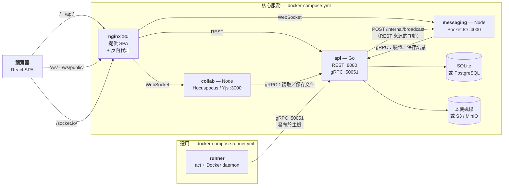

<div align="center">


# Notomate

*筆記（note）+ 自動化（automate）。*

可自行架設、功能完整的筆記軟體，內建類似 GitHub Actions 的工作流自動化引擎。

[English](./README.md) · **繁體中文**

</div>

隨手記下任何內容 — 從一則短短的備忘到一篇完整的部落格文章都行。以區塊（block）為基礎的編輯器支援富文本、媒體、嵌入等內容。內建[工作流引擎](#工作流beta)讓筆記也能自動化：排程 AI 摘要、彙整外部資料，或觸發通知。完全自行架設，資料始終屬於你自己。

## 安裝

### Docker Compose（推薦）

```yaml
services:
  api:
    image: notomate/notomate-api
    container_name: notomate-api
    volumes:
      - notomate_data:/usr/local/app/bin
    environment:
      MESSAGING_ADDR: http://notomate-messaging:4000
      # APP_SECRET: your-secret-key
      # APP_DISABLE_SIGNUP: true
    restart: unless-stopped

  collab:
    image: notomate/notomate-collab
    container_name: notomate-collab
    environment:
      GRPC_ADDR: notomate-api:50051
      # APP_SECRET: your-secret-key
    depends_on:
      - api
    restart: unless-stopped

  messaging:
    image: notomate/notomate-messaging
    container_name: notomate-messaging
    environment:
      GRPC_ADDR: notomate-api:50051
      # APP_SECRET: your-secret-key
    depends_on:
      - api
    restart: unless-stopped

  nginx:
    image: notomate/notomate-nginx
    container_name: notomate-nginx
    ports:
      - "80:80"
    depends_on:
      - api
      - collab
      - messaging
    restart: unless-stopped

volumes:
  notomate_data:
    driver: local
```

```bash
docker compose up -d
```

啟動後即可於 `http://localhost` 存取應用程式。設定選項請參閱 [`.env.example`](./.env.example)。

四個服務都是必要的 —— `collab` 支撐即時協作編輯器，`messaging` 支撐頻道聊天，nginx 會同時反向代理到這兩者。有兩點要注意：

- **`APP_SECRET` 在 `api`、`collab`、`messaging` 上必須一致。** 它用來簽發三者都要驗證的 session JWT，也用來驗證 api → messaging 的廣播呼叫。
- **不要更改 container 名稱。** nginx 以 `notomate-api`、`notomate-collab`、`notomate-messaging` 這些名稱解析服務，`MESSAGING_ADDR` 與 `GRPC_ADDR` 也指向同樣的名稱。

## 架構



| 服務 | 職責 |
| --- | --- |
| **nginx** | 唯一入口（`:80`）。提供打包好的 SPA，並將 `/api/` 反向代理到 api、`/ws/` 與 `/ws/public/` 到 collab、`/socket.io/` 到 messaging。 |
| **api** | Go 後端，也是唯一會寫入資料庫與物件儲存的服務。提供 REST API，以及給 collab、messaging、runner 呼叫的 gRPC 服務。 |
| **collab** | Hocuspocus/Yjs 伺服器，負責即時多人協作編輯。本身無狀態 —— 透過 api 的 gRPC 服務讀取與保存文件。 |
| **messaging** | Socket.IO 伺服器，負責頻道聊天與線上狀態。每條連線只綁定單一頻道，訊息透過 gRPC 交由 api 保存。房間狀態存於記憶體，因此只能跑單一副本。 |
| **runner** | 選用的工作流執行器，自成一個 compose 專案。透過 gRPC 向 api 長輪詢排隊中的 job，並以 [act](https://github.com/nektos/act) 在容器中執行。詳見[工作流](#工作流beta)。 |

## 工作流(Beta)

Notomate 內建類似 GitHub Actions 的工作流引擎。工作流以 workspace 為範圍(側邊欄的「工作流」頁面),使用與 GitHub Actions 相容的 YAML 定義,由獨立的 runner 服務透過 [act](https://github.com/nektos/act) 在 Docker 容器中執行每個 job — 由於 job 可以執行任何 CLI 指令或呼叫任何 HTTP API,你可以自由編排出各種自動化場景,例如:

- **AI 彙整摘要** — 定期呼叫 LLM API,把 RSS feed、GitHub issues 或大量筆記彙整成一則好讀的摘要筆記
- **資料彙整** — 定期輪詢公開或內部 API,把結果滾動寫入日誌或每日摘要筆記
- **通知提醒** — 監控筆記變更或外部事件,轉發到 Slack、Discord、email 等
- **跨系統同步** — 把筆記與行事曆、issue tracker 或團隊使用的其他工具互相同步

下方 [工作流範例](#工作流範例) 提供可直接使用的起點。

支援的觸發方式:

- `note` — workspace 內筆記 `created` / `updated` / `deleted` 事件(更新事件會去抖動)
- `schedule` — 標準五欄位 cron 排程
- `workflow_dispatch` — 手動觸發,可帶輸入參數

```yaml
name: Notify on note changes
on:
  note:
    types: [created, updated]
  schedule:
    - cron: "0 9 * * 1"
  workflow_dispatch:
    inputs:
      message:
        default: "hello"
jobs:
  notify:
    runs-on: ubuntu-latest
    steps:
      - run: |
          echo "event=$NM_EVENT_NAME workspace=$NM_WORKSPACE_ID note=$NM_NOTE_ID"
          cat "$GITHUB_EVENT_PATH"   # 完整事件內容(JSON)
```

Job 可透過 `$GITHUB_EVENT_PATH` 讀取事件內容,並有 `NM_EVENT_NAME`、`NM_WORKSPACE_ID`、`NM_NOTE_ID`、`NM_RUN_ID`、`NM_RUN_NUMBER` 等環境變數。

### 啟用 Runner

Runner 為選用服務,自成一個獨立的 compose 專案(`docker-compose.runner.yml`),可以不依附核心服務單獨啟動,甚至跑在不同主機上:

```bash
docker compose -f docker-compose.runner.yml up -d
```

`docker-compose.yml` 會把 api 的 gRPC 埠發布到 `127.0.0.1:50051`,同一台主機上的 runner 預設用 `host.docker.internal:50051` 即可連上。若 runner 要跑在別的主機,需要把該埠更開放地發布出去(請留意下方安全性注意事項),並把 `NM_INSTANCE_ADDR` 指向該主機:

```yaml
  notomate-runner:
    image: notomate/notomate-runner
    container_name: notomate-runner
    environment:
      NM_INSTANCE_ADDR: host.docker.internal:50051 # 或 remote-host:50051
      NM_RUNNER_REGISTRATION_TOKEN: your-registration-token
      NM_RUNNER_LABELS: ubuntu-latest:docker://node:20-bullseye
    volumes:
      - /var/run/docker.sock:/var/run/docker.sock
      - notomate_runner_data:/data
    restart: unless-stopped
```

站台管理員可在 workspace 設定頁查看已註冊的 runner 與註冊 token。

### 工作流範例

更多可直接使用的範例請參閱 [`runner/workflow_examples`](./runner/workflow_examples):

- [`scheduled-note.yml`](./runner/workflow_examples/scheduled-note.yml) — 最小範本,定期在同一個 workspace 建立一則新筆記
- [`manual-note-from-input.yml`](./runner/workflow_examples/manual-note-from-input.yml) — 以 `workflow_dispatch` 輸入內容建立筆記
- [`rss-to-notes.yml`](./runner/workflow_examples/rss-to-notes.yml) — 訂閱 RSS feed,每篇新文章建立一則筆記
- [`hacker-news-digest.yml`](./runner/workflow_examples/hacker-news-digest.yml) — 每天彙整 Hacker News 熱門文章成單一摘要筆記
- [`github-releases-watch.yml`](./runner/workflow_examples/github-releases-watch.yml) — 監控 repo 最新 GitHub release 並發出通知筆記

**安全性注意事項**

- 工作流會在 runner 主機的 Docker daemon 上執行任意指令。僅 workspace 擁有者/管理員可建立或編輯工作流,runner 主機屬於你的信任邊界。
- 請勿在工作流 YAML 中放入機密 — 定義對所有 workspace 成員可見。若 job 需要呼叫 Notomate API,請使用 API key,並注意會修改筆記的工作流可能自我觸發(每個工作流每分鐘 30 次執行的上限為保險機制)。
- runner 協定有 token 驗證但無 TLS。gRPC 連接埠(50051)不要暴露在公開網路上 —— `docker-compose.yml` 預設綁定 `127.0.0.1:50051` 只允許同主機存取,若 runner 在遠端,只能透過受信任的網路(VPN、私有網路)才放寬綁定範圍。

## 貢獻

歡迎貢獻!Fork 此專案、建立功能分支，然後發起 Pull Request。

## 授權

Notomate 採用 **MIT 授權條款**。
